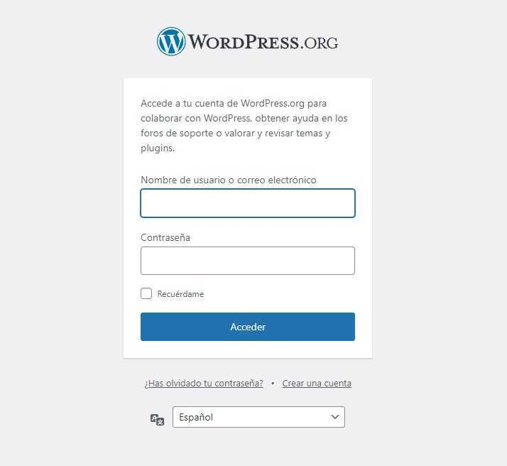
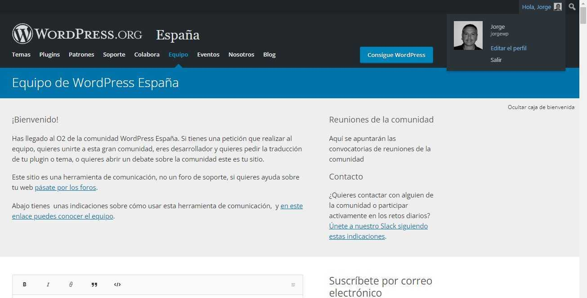
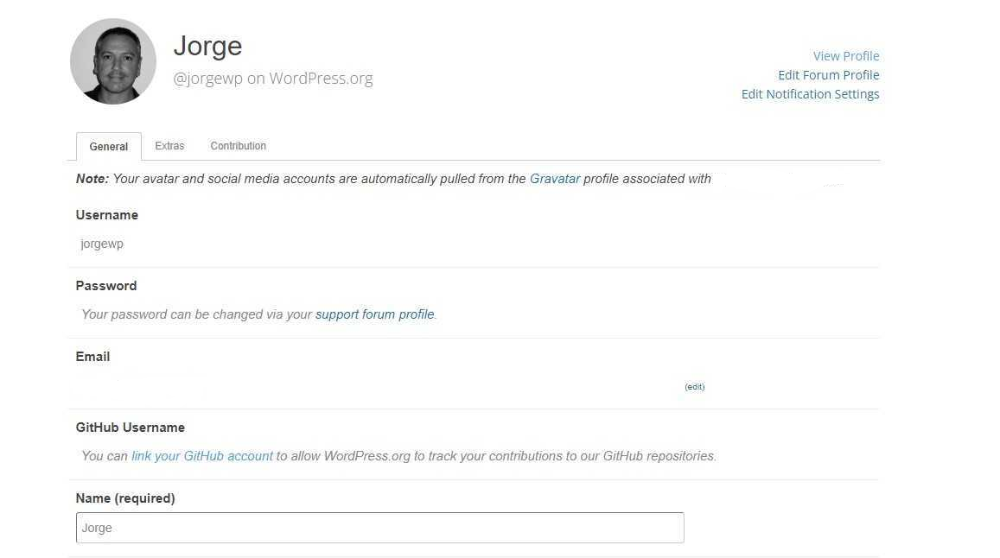
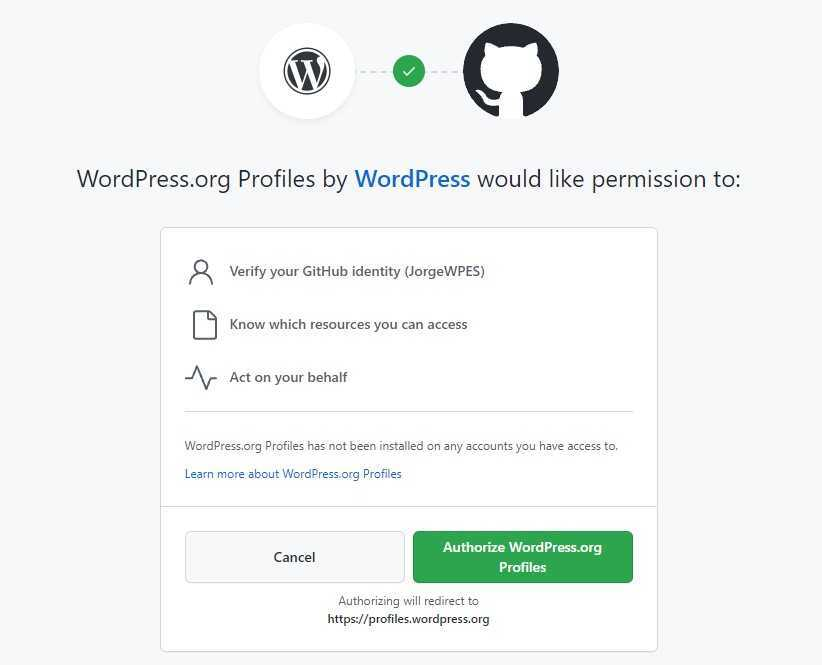
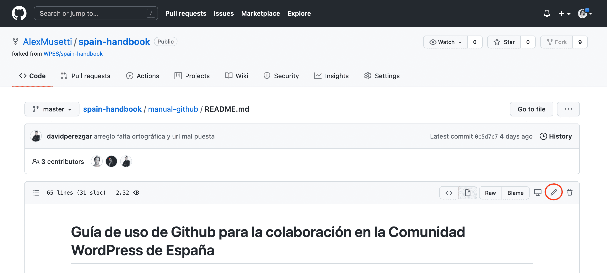
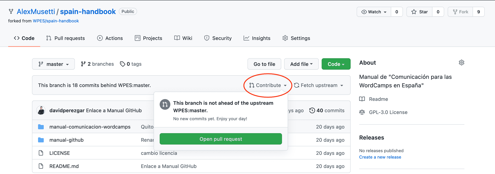
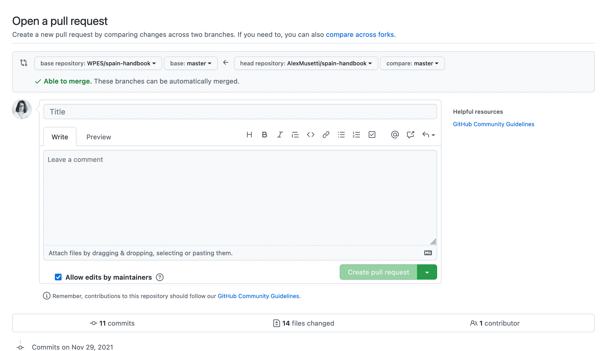
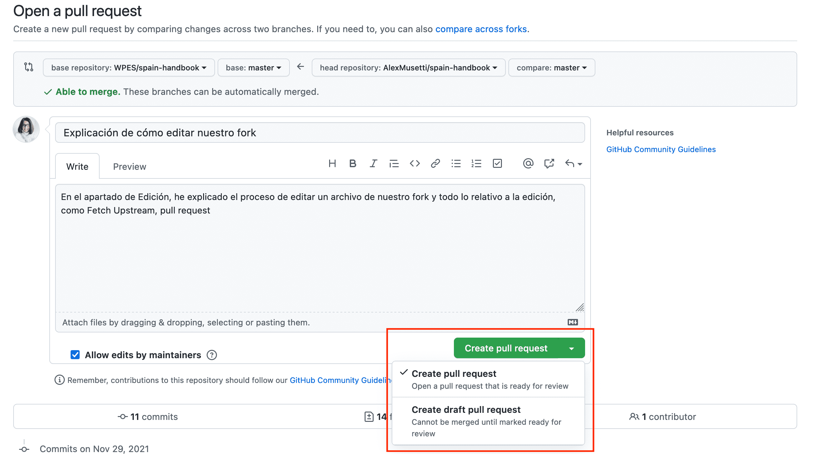
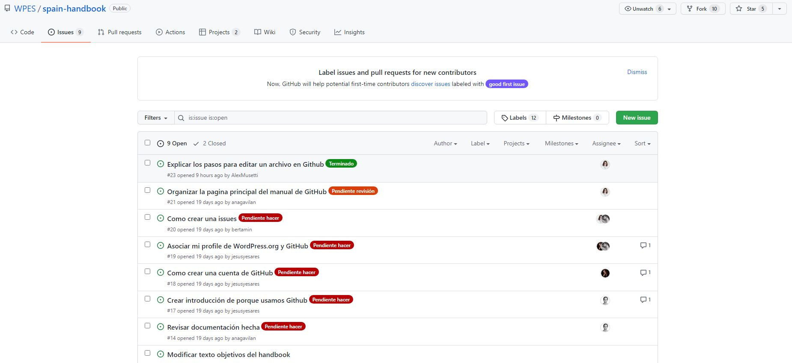

# Manual de GitHub

Los manuales de este repositorio son el resultado de un trabajo colaborativo. Para ello es necesario usar herramientas como GitHub, que permite el registro y control de versiones.

Este manual pretende ser una guía de introducción a GitHub para principiantes, para obtener información más completa se puede visitar la página oficial .

## Guía de uso de Github
1. [Crear una cuenta en GitHub](#paso1)
   * 1.1. [Enlazar perfiles WordPress y GitHub](#paso1-1)
2. [Trabajar en repositorio](#paso2)
   * 2.1. [Hacer una copia del repositorio en nuestra cuenta de GitHub (fork)](#paso2-1)
3. [Edición del archivo](#paso3)
   * 3.1. [Editar](#paso3-1)
   * 3.2. [Fetch upstream](#paso3-2)
   * 3.3. [Pull request](#paso3-3)
4. [Gestión de proyectos](#paso4)
   * 4.1. [Crear y personalizar issues](#paso4-1)

## 1. Crear una cuenta en GitHub

Para crearte una cuenta en GitHub, debes ir a su página principal [github.com](https://github.com/) y crearte una cuenta.

Nos damos de alta en GitHub a través de la opción de “Sign up” que está rodeada con un círculo rojo.

Una vez que hemos creado nuestra cuenta, ya podemos acceder el repositorio donde está ubicado el manual dentro de GitHub, que se encuentra en [WPES/spain-handbook](https://github.com/WPES/spain-handbook).

[Volver arriba](#top)

### 1.1. Enlazar perfiles WordPress y GitHub

Para enlazar ambos perfiles es necesario loguearse en https://es.wordpress.org/

Pinchamos en la opción “Editar el perfil” que aparece en la parte superior a la derecha.

A continuación, podemos ver la información de nuestro perfil.

Y en el apartado GitHub Username podemos ver un enlace que permite vincular la cuenta de WordPress con la de GitHub, al pinchar sobre este enlace.

Se abrirá una ventana como la siguiente donde debemos autorizar el acceso al perfil de WordPress.org

[Volver arriba](#top)

## 2. Trabajar en repositorio

Una vez registrados podemos acceder a la página principal de  y en la barra lateral aparecerá el listado de repositorios a los que tenemos acceso.

Pinchamos en  para acceder al repositorio de manuales de WordPress España. En la parte superior izquierda podremos ver en todo momento en qué repositorio estamos.

Con el fin de evitar posibles errores o conflictos es importante no trabajar nunca directamente en este repositorio principal. Para poder editar con seguridad, crearemos una copia del repositorio principal (fork) que será donde trabajaremos.

[Volver arriba](#top)

### 2.1. Hacer una copia del repositorio en nuestra cuenta de GitHub (fork)

Crearemos el Fork pinchando en el último botón que aparece en la parte superior derecha, está rodeado en azul para que puedas localizarlo más fácilmente.

Después de realizarlo, la ventana cambiará y si nos fijamos en la ruta que se muestra en la parte de arriba a la izquierda ya aparecerá nuestro nombre de usuario, desde este momento cualquier cambio que hagamos en este repositorio, no afectará al repositorio original hasta que no hagamos un Pull Request y éste no sea verificado y aprobado.

[Volver arriba](#top)

## 3. Edición del archivo

### 3.1. Editar:

#### **Para editar:**

Una vez creado nuestro *fork* podemos proceder a editar el archivo, para ello pulsaremos el icono en forma de lápiz.

#### **Para validar los cambios de edición:**

Al terminar la edición, para guardar los cambios, debemos ir al final de la página, rellenar los campos correspondientes a *commit changes* y pulsar *Commit changes*.

Si queremos añadir los cambios en nuestro *fork*, dejaremos seleccionada la opción "*Commit directly to the master branch.*". De lo contrario estaríamos creando una nueva rama a partir de nuestro *fork*.

[Volver arriba](#top)

### 3.2 Fetch upstream

**Si nuestro *fork* deja de estar actualizado:**

Cuando se trabaja en un *fork*, se trabaja paralelamente al archivo máster. Es decir, los cambios producidos en el archivo principal (máster) no se sincronizan automáticamente con nuestro *fork*.

GitHub nos lo indicará con la siguiente frase:
*“This branch is 8 commits behind WPES:master.”*
Significa que se han realizado 8 modificaciones desde que hicimos nuestra copia (*fork*).

A continuación un ejemplo del aviso:

En este caso, si el archivo principal se ha adelantado a nuestra versión, tenemos dos opciones: *Contribute* o *Fetch upstream*

Si ya hemos editado nuestro archivo, pulsaremos *Contribute*, aparecerá una pequeña ventana que indica que el archivo no está actualizado y nos invita a hacer un *Pull request* para fusionar nuestra edición con el archivo principal (máster).

Si no hemos realizado aun cambios en nuestro fork, para trabajar en la versión aceptada más actualizada del archivo principal (máster), podemos pulsar en *Fetch Upstream*, que nos dará a su vez dos opciones más: *Compare* o *Fetch and merge*

*Compare* nos permite comparar las distintas versiones que se han creado y *Fetch and merge* sincronizará nuestro *fork* con el archivo principal (máster). 

En cualquier caso, si hubiera algún conflicto entre ambas versiones, el sistema nos avisará y nos invitará a hacer antes un *Pull request*.

A continuación una imagen de lo que nos mostraría la opción *compare*:

[Volver arriba](#top)

### 3.3 Pull request

Cuando terminamos de editar nuestro archivo podemos proceder a realizar un *pull request*, nuestro archivo se enviará al administrador para su revisión y, una vez realizadas las comprobaciones pertinentes, nuestro *fork* se fusionará con el archivo principal.

Para hacer *pull request* a partir de nuestro *fork*:

1. Ir al repositorio principal y una vez allí, pulsar en *Pull requests*

2. En pantalla aparecerá un listado con los *pull requests* existentes en ese momento (si los hay), para crear el nuestro pulsaremos en *New pull request*

3. En este paso tenemos la oportunidad de comparar el archivo principal con nuestra propuesta, como en nuestro caso lo estamos haciendo desde un fork, pulsaremos *compare accross forks*, puesto que necesitamos indicar qué dos archivos vamos a comparar.

4. Nos aparecerá un nuevo encabezado en el que podremos seleccionar nuestro fork pulsando en el desplegable *head repository*

5. Si no hay ningún conflicto entre ambas versiones, el sistema nos indicará *Able to merge*, lo que significa que ya podemos pulsar la opción *Create pull request*

.

6. En la siguiente pantalla aparecerá una ventana con los campos *Title* para poner un título a nuestra propuesta y *Write* para añadir los comentarios necesarios. 

Es imprescindible rellenar el campo *Title* para que se habilite la opción *Create pull request*, de lo contrario, la selección permanecerá deshabilitada.

7. Cuando terminamos de rellenar los campos, pulsamos sobre *create pull request* y se abre un desplegable con dos opciones como vemos en la siguiente imagen. 

Dejaremos seleccionada la primera opción si nuestro archivo ya está listo para revisión.

[Volver arriba](#top)

## 4. Gestión de proyectos

Al tratarse de un trabajo colaborativo se necesita un alto grado de organización y coordinación. 
GitHub nos permite crear *issues*, que son como tareas o acciones que deben realizarse.

Para facilitar la organización, estas *issues* se agrupan por proyectos. Y con el propósito de mantener la coordinación entre los distintos colaboradores, las *issues* pueden asignarse a personas.

[Volver arriba](#top)

### 4.1. Crear y personalizar issues

En el menú principal de GitHub accedemos al apartado de Issues y podemos ver un listado de todas las *issues* ya creadas.
Para crear una nueva *issue* pinchamos en el botón "New Issue".

Se abrirá una ventana, como la que se ve a continuación, con cuatro áreas señaladas: 

1. espacio para introducir el título,  
2. espacio para comentarios,
3. botón de *Submit new issue*,
4. opciones de edición de la *issue*

Debemos introducir un título y un breve comentario al respecto, una vez hecho podemos pinchar en *Submit new issue* para guardarla.

Adicionalmente, en el lateral derecho podemos personalizar algunas opciones como *Assignees*, para asignar la issue a una persona, *Labels*, para etiquetar/clasificar la issue, y finalmente *Projects* para asignar la issue al proyecto elegido. 

Para hacerlo pinchamos sobre la rueda correspondiente y se despliega una ventana con las opciones. Seleccionamos nuestra elección y pinchamos fuera del área para que la opción marcada quede guardada.

A continuación varias capturas de ejemplo:

**para seleccionar la persona asignada:**

**para clasificar con etiquetas:**

**para seleccionar el proyecto asignado:**

A continuación una imagen de la *issue* una vez editada y guardada

### 4.2. Consultar *issues*

Una vez creada la *issue* podemos ir al [repositorio principal](https://github.com/WPES/spain-handbook) y acceder al listado de *issues* pinchando en *Issues*. 

A continuación podemos ver cómo la *issue* recién creada ya aparece en el listado.

### 4.3. Organizar *issues* en Proyectos

Si accedemos al apartado de *Projects* desde el menú principal de GitHub podremos ver un listado de todas las etiquetas y en qué estado de realización se encuentra cada una de ellas.

En la parte de la derecha aparece la opción "Add cards" con un punto azul, notificando que hay una nueva *issue*.

Al pinchar sobre esta opción podemos ver la *issue* que hemos creado y arrastrarla a la columna correspondiente: "To Do", "In progress" y "Done".

Si pinchamos sobre el título azul, saldrá una flecha de 4 puntas que servirá para arrastrar la *issue*.

Aquí podemos ver que la *issue* de prueba ha sido incluida en la columna “To do”.

[Volver arriba](#top)

