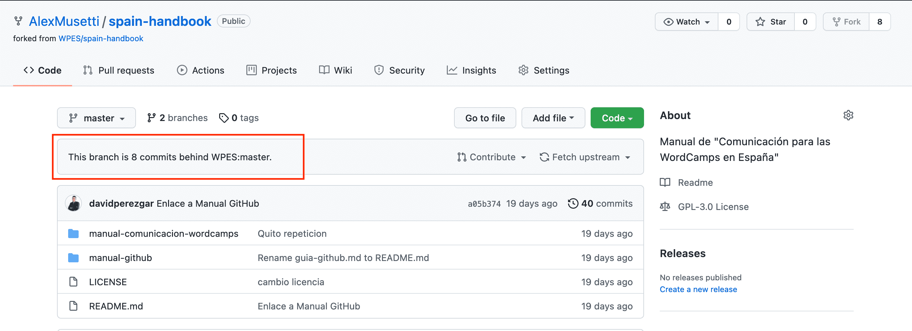
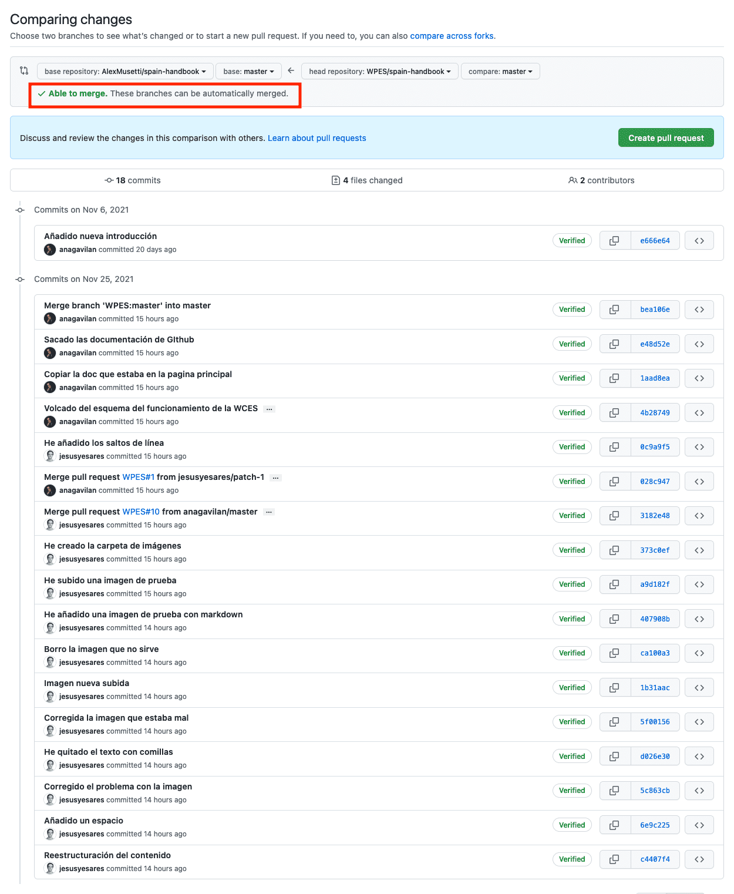

# Guía de uso de Github para la colaboración en la Comunidad WordPress de España

## ¿En qué procesador de textos lo escribimos?
En realidad, vamos a usar un editor de texto plano con formato **Markdown**. Se trata de un formato de texto que podemos editar con cualquier editor de código como Visual Studio Code, Sublime Text o Atom o en la misma web de GitHub (recomendado), en el que el formato se introduce con una serie de comandos que veremos a continuación.

## Pasos a seguir para colaborar en el manual a través de Github
1. [Crear una cuenta en Github](#paso1)
2. [Hacer una copia del repositorio en nuestra cuenta de github (fork)](#paso2)
3. [Edición del archivo](#paso3)
4. [Fetch upstream](#paso4)
5. [Pull request](#paso5)

## 1. Crear una cuenta en Github
Para crearte una cuenta en Github, debes ir a su página principal [github.com](https://github.com/) y crearte una cuenta.

Una vez que hemos creado nuestra cuenta, buscaremos el repositorio donde se encuentra el manual dentro de Github, que se encuentra en [WPES/spain-handbook](https://github.com/WPES/spain-handbook).

[Cómo colaborar en un proyecto en Github](https://gist.github.com/BCasal/026e4c7f5c71418485c1) **(esto queda provisional)**

[Volver](#top)

## 2. Hacer una copia del repositorio en nuestra cuenta de github (fork)
A continuación, debemos realizar un Fork para poder tener acceso a dicho repositorio desde nuestra cuenta de GitHub.
Antes de hacer nada debemos fijarnos si estamos en el repositorio correcto a través de la ruta que indica en la parte superior izquierda, esto es importante ya que una vez que hayamos hecho el Fork, si este está bien hecho la ruta cambiara.
Para realizar el Fork debemos pinchar en el último botón que aparece en la parte superior derecha, está rodeado en azul para que puedas localizarlo más fácilmente.

Después de realizarlo, la ventana cambiará y si nos fijamos en la ruta que se muestra en la parte de arriba a la izquierda ya aparecerá nuestro nombre de usuario, desde este momento cualquier cambio que hagamos en este repositorio, no afectará al repositorio original hasta que no hagamos un Pull Request y éste no sea verificado y aprobado.

[Volver](#top)

## 3. Edición del archivo

#### **Para editar:**

Una vez creado nuestro *fork* podemos proceder a editar el archivo, para ello pulsaremos el icono en forma de lápiz.

#### **Para validar los cambios de edición:**

Al terminar la edición, para guardar los cambios, debemos ir al final de la página, rellenar los campos correspondientes a *commit changes* y pulsar *Commit changes*.

Si queremos añadir los cambios en nuestro *fork*, dejaremos seleccionada la opción "*Commit directly to the master branch.*". De lo contrario estaríamos creando una nueva rama a partir de nuestro *fork*.

[Volver](#top)

## 4. Fetch upstream

**Si nuestro *fork* deja de estar actualizado:**

Cuando se trabaja en un *fork*, se trabaja paralelamente al archivo máster. Es decir, los cambios producidos en el archivo principal (máster) no se sincronizan automáticamente con nuestro *fork*.

GitHub nos lo indicará con la siguiente frase:
*“This branch is 8 commits behind WPES:master.”*
Significa que se han realizado 8 modificaciones desde que hicimos nuestra copia (*fork*).

A continuación un ejemplo del aviso:

En este caso, si el archivo principal se ha adelantado a nuestra versión, tenemos dos opciones: *Contribute* o *Fetch upstream*

Si ya hemos editado nuestro archivo, pulsaremos *Contribute*, aparecerá una pequeña ventana que indica que el archivo no está actualizado y nos invita a hacer un *Pull request* para fusionar nuestra edición con el archivo principal (máster).

Si no hemos realizado aun cambios en nuestro fork, para trabajar en la versión aceptada más actualizada del archivo principal (máster), podemos pulsar en *Fetch Upstream*, que nos dará a su vez dos opciones más: *Compare* o *Fetch and merge*

*Compare* nos permite comparar las distintas versiones que se han creado y *Fetch and merge* sincronizará nuestro *fork* con el archivo principal (máster). 

En cualquier caso, si hubiera algún conflicto entre ambas versiones, el sistema nos avisará y nos invitará a hacer antes un *Pull request*.

A continuación una imagen de lo que nos mostraría la opción *compare*:

[Volver](#top)

## 5. Pull request

Cuando terminamos de editar nuestro archivo podemos proceder a realizar un *pull request*, nuestro archivo se enviará al administrador para su revisión y, una vez realizadas las comprobaciones pertinentes, nuestro *fork* se fusionará con el archivo principal.

Para hacer *pull request* a partir de nuestro *fork*:

1. Ir al repositorio principal y una vez allí, pulsar en *Pull requests*

2. En pantalla aparecerá un listado con los *pull requests* existentes en ese momento (si los hay), para crear el nuestro pulsaremos en *New pull request*

3. En este paso tenemos la oportunidad de comparar el archivo principal con nuestra propuesta, como en nuestro caso lo estamos haciendo desde un fork, pulsaremos *compare accross forks*, puesto que necesitamos indicar qué dos archivos vamos a comparar.

4. Nos aparecerá un nuevo encabezado en el que podremos seleccionar nuestro fork pulsando en el desplegable *head repository*

5. Si no hay ningún conflicto entre ambas versiones, el sistema nos indicará *Able to merge*, lo que significa que ya podemos pulsar la opción *Create pull request*

.

6. En la siguiente pantalla aparecerá una ventana con los campos *Title* para poner un título a nuestra propuesta y *Write* para añadir los comentarios necesarios. 

Es imprescindible rellenar el campo *Title* para que se habilite la opción *Create pull request*, de lo contrario, la selección permanecerá deshabilitada.

7. Cuando terminamos de rellenar los campos, pulsamos sobre *create pull request* y se abre un desplegable con dos opciones como vemos en la siguiente imagen. 

Dejaremos seleccionada la primera opción si nuestro archivo ya está listo para revisión.

## Pasos a seguir (esquema WCES)

Como editor:

Paso 1: Hacer Fork

Paso 2: 
- Hacer modificación (editar archivo)
- Comentar la modificación
- Enviar la propuesta de cambio

Paso 3: Pull request

Como moderador:

Paso 1: Revisar los pull request

Paso 2: Aprobación o modificación de los pull request.

Como editor cuando volvemos a editar:

Paso 1: Hacer "Fetch upstream" y dar a "fetch and merge" si queremos unir o "compare" si no tenemos claro.

## Cómo funciona Markdown

Es muy fácil, consulta el siguiente manual y, en apenas 10 minutos lo tendrás listo.

[Manual de Markdown](https://commonmark.org/help/)

[Generador de tablas en Markdown](https://www.tablesgenerator.com/markdown_tables)

[Cómo colaborar en un proyecto en Github](https://gist.github.com/BCasal/026e4c7f5c71418485c1)

Es muy importante que, antes de hacer absolutamente nada, creemos una rama. La nombraremos con nuestro nombre de usuario en WordPress.org y un pequeño texto descriptivo. separado por guiones.

Una vez que terminemos de hacer los cambios, haremos un commit y posteriormente un pull request.

